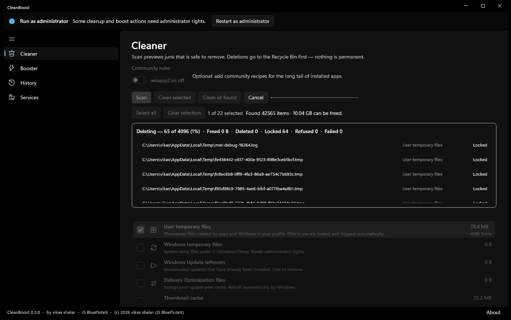
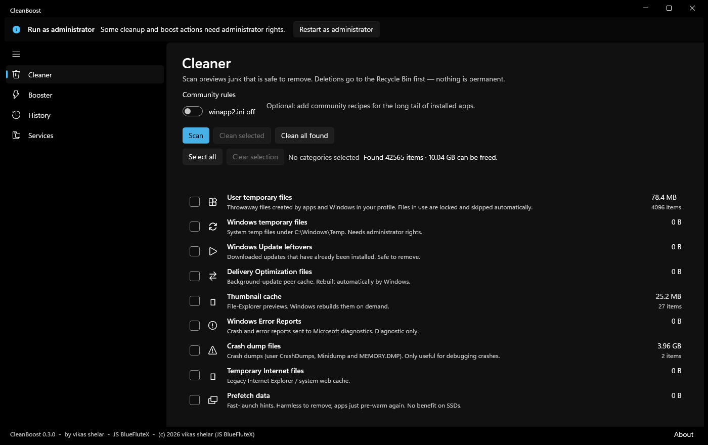
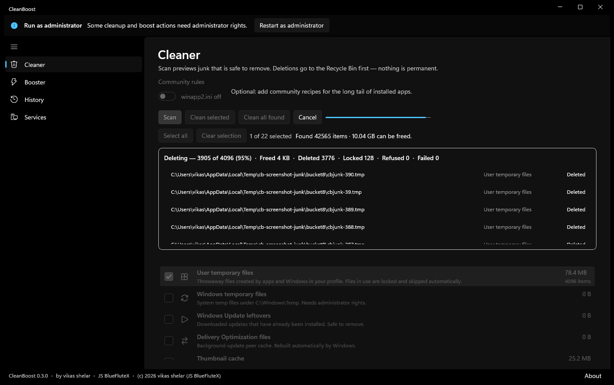
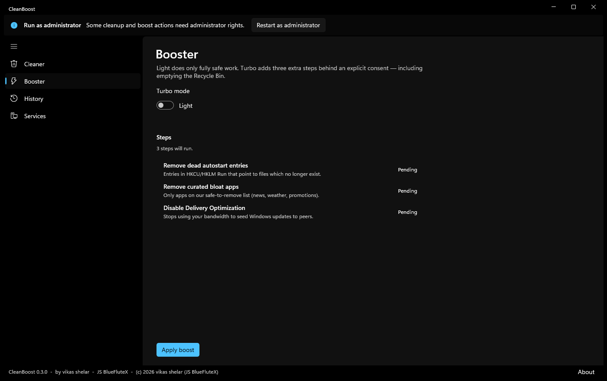
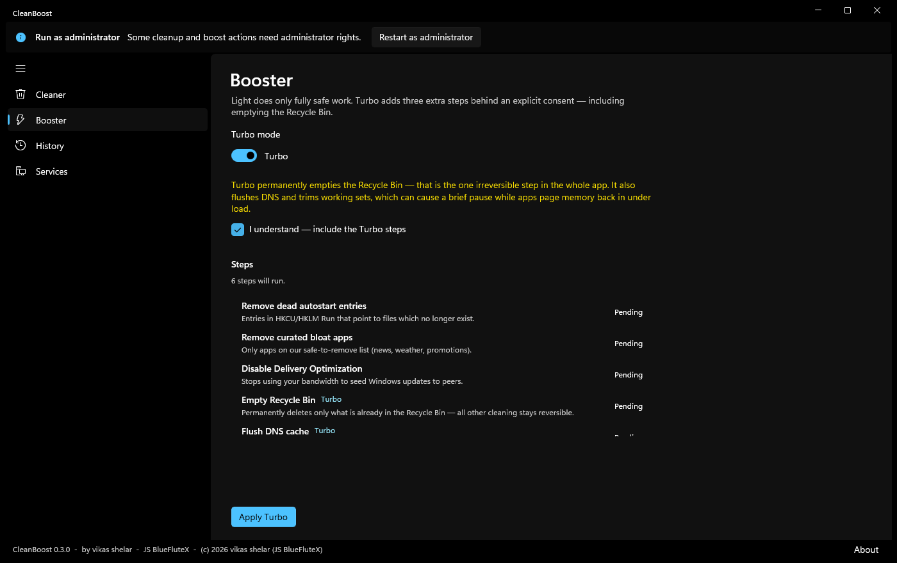
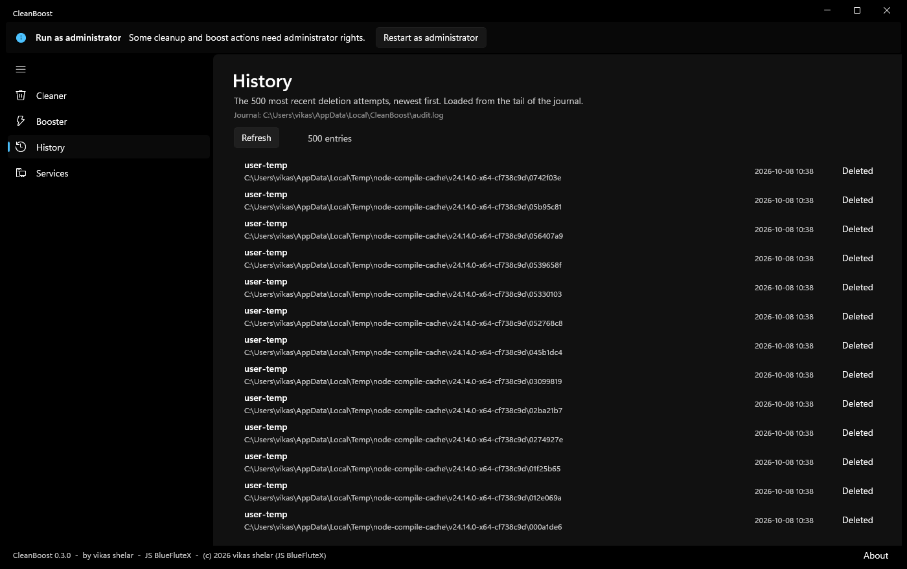
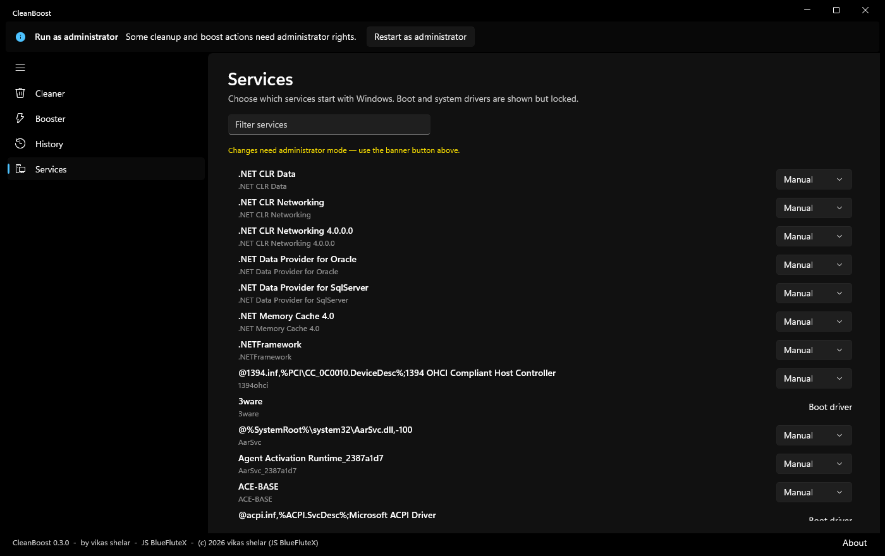
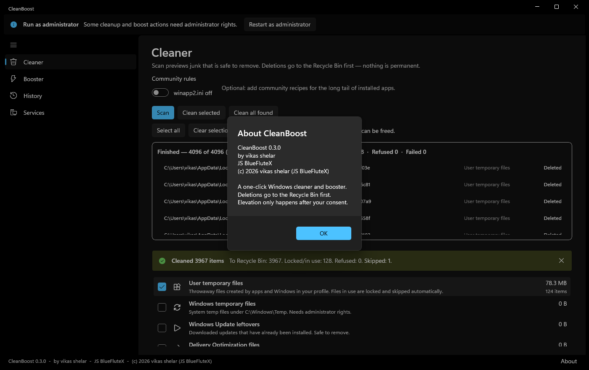

<div align="center">
  
  <h1>CleanBoost</h1>
  <p><strong>A one-click Windows cleaner and booster that will not delete anything you cannot get back.</strong></p>
</div>

<div align="center">

[](https://github.com/vikasdocker/CleanBoost/actions/workflows/ci.yml)
[](https://github.com/vikasdocker/CleanBoost/releases/latest)
[](LICENSE)
[](THIRD-PARTY-NOTICES.md)
[](https://learn.microsoft.com/windows/apps/windows-app-sdk/)

</div>

---

Scan what is on your machine, see exactly what would go, and watch it happen —
file by file. Everything the cleaner removes goes to the **Recycle Bin** first.



<sub>Live cleanup: a determinate progress bar, a running tally, and every file with its
outcome as it is processed. Locked files are skipped, never forced.</sub>

## Why this exists

Most "cleaners" are a list of scary-sounding checkboxes and a percentage that
disappears. CleanBoost is built around three commitments instead:

| | |
|---|---|
| **Nothing is permanent** | Deletions go to the Recycle Bin. If you did not mean to remove it, restore it. |
| **You see every file** | A live per-file log with per-file outcomes, not just "Cleaned 12,043 items". |
| **Nothing happens without consent** | Elevation is opt-in. Irreversible steps (emptying the Recycle Bin) sit behind a separate Turbo checkbox. |

There is **no registry cleaning module**. That is a deliberate omission, not a
missing feature.

## What it does

### Cleaner

22 hand-curated categories covering Windows leftovers, update residue, browser and
application caches, error reports and crash dumps. Optionally, the 4,000+ community
recipes in [Winapp2.ini](https://github.com/MoscaDotTo/Winapp2).

| | |
|---|---|
|  |  |
| **Scan** previews sizes and item counts per category. Nothing is touched until you say so. | **Select all / Clean all found** — or pick categories by hand. |

- **Live progress.** A determinate bar plus a per-file list (path, category,
  outcome), newest first, with a running tally of deleted, locked, refused and
  failed. **Cancel** stops a run between batches.
- **Select all**, **Clear selection**, **Clean selected**, **Clean all found**.
- Optional **community rules** toggle for the long tail of installed apps.

### Booster

| | |
|---|---|
|  |  |
| **Light** — three fully safe steps: remove dead startup entries, remove curated bloat apps, disable Delivery Optimization. | **Turbo** — adds empty Recycle Bin, flush DNS and trim RAM, behind an explicit consent checkbox. |

Every step shows live `Pending → Running → Done / Failed`. Runs are cancellable, and
you are warned up front if a queued step needs administrator mode.

### History and Services

| | |
|---|---|
|  |  |
| **History** — the 500 most recent deletion attempts with timestamps and outcomes, read from the tail of the journal. | **Services** — choose which services start with Windows. Boot and system drivers are shown but locked. |



<sub>Version and authorship are surfaced in-app via the About dialog and the footer
bar, so the shipped build is always identifiable.</sub>

## Safety model

These are the rules the code enforces, not aspirations.

- **Recycle Bin first.** Every deletion routes through `SafeDeleter` to
  `RecycleBinDeleter` (`SHFileOperation` with `FOF_ALLOWUNDO`). There is no permanent
  delete path in the Cleaner.
- **Path guard.** `PathGuard` refuses Windows, System32, WinSxS, Program Files,
  ProgramData and `AppData\Local\Packages` roots. Carve-outs are explicit and narrow
  (`Windows\Temp`, `SoftwareDistribution`, Prefetch, Minidump, WER).
- **Validated individually, then batched.** Safety checks (guard, existence,
  symlink) run **per file**. Only files that pass are handed to the backend in
  batches of 64 — a batch call can never make a safety decision.
- **Symbolic links are never followed.**
- **Empty-folder pruning is bounded.** Pruning stops at the category target and never
  ascends above it. Targets must opt in via `RemoveSelf`.
- **Locked and in-use files are skipped**, never forced.
- **Risk levels** — `Safe` / `Caution` / `ConfirmFirst` / `Protected`. Anything
  `ConfirmFirst` prompts first, including when reached through *Clean all found*.
- **Elevation is consent-gated.** The app never self-elevates; a banner offers a
  UAC relaunch.
- **Audit log.** Every attempt is appended to `%LocalAppData%\CleanBoost\audit.log`
  with path, outcome and reason, rotating past 24 MB.

## Install

Grab the latest from **[Releases](https://github.com/vikasdocker/CleanBoost/releases/latest)**.

| Asset | Use |
|---|---|
| `CleanBoost-x64-*.msi` | Standard installer. Replaces previous versions in place. |
| `CleanBoost-x64-*.msix` | MSIX. Signed with a **self-signed development certificate** — sideload only, not Store-ready. |
| `CleanBoost-x64-*-portable.zip` | No install. Unzip and run `CleanBoost.exe`. |

Requires 64-bit Windows 10 (1809+) or Windows 11. Administrator mode is optional and
only unlocks system-wide categories.

## Build from source

Requires the .NET SDK pinned in `global.json` (**8.0.425**) on Windows.

```powershell
git clone https://github.com/vikasdocker/CleanBoost.git
cd CleanBoost

dotnet test tests/CleanBoost.Tests            # 46 tests
dotnet build src/CleanBoost.App -c Release -r win-x64
```

Optional, Windows-only checks (elevation helper):

```powershell
dotnet test tests/CleanBoost.Tests -c Release -p:RunWindowsTests=true   # 48 tests
```

Full release — publishes self-contained, generates icons, packs and signs the MSIX,
builds the MSI, and zips the portable build:

```powershell
powershell -ExecutionPolicy Bypass -File scripts/build-release.ps1
```

Additional tooling:

| Script | Purpose |
|---|---|
| `scripts/build-release.ps1` | One-shot release build (add `-Upload` to push assets to an existing tag). |
| `tools/capture-screenshots.ps1` | Drives the app and regenerates `docs/screenshots/`. |
| `tools/generate-icons.ps1` | Regenerates the MSIX/Store logo set. |
| `tools/gen-wix-files.ps1` | Regenerates the WiX component list from a publish folder. |

> `build-release.ps1 -Upload` only calls `gh release upload`, so the GitHub release
> must already exist. For a first release, run the build without `-Upload`, then
> `gh release create` with the artifacts.

## Architecture

Three projects with a strict dependency direction. Nothing in `Core` knows about
Windows; nothing in `System` knows about UI.

```
src/
  CleanBoost.Core/       Pure engine. No OS dependencies, fully unit-tested.
    Catalog/             Built-in categories, targets, risk levels
    Scan/                ScanEngine, PathResolver, ScanReport
    Deletion/            SafeDeleter (the single deletion funnel), IDeleter
    Safety/              PathGuard, GuardFactory
    Rules/               Winapp2.ini parser
    Audit/               Append-only audit journal

  CleanBoost.System/     Windows layer: Win32, shell, registry, WinRT.
    Recycle/             RecycleBinDeleter (SHFileOperation), RecycleBin
    Boost/               BoostCatalog, BoostExecutor
    Debloat/             AppxManager
    Services/ Startup/ SystemTweaks/ Processes/ Elevation/ Interop/

  CleanBoost.App/        WinUI 3 shell.
    Pages/               CleanerPage, BoosterPage, HistoryPage, ServicesPage
    Services/            ThrottledProgress (bounded UI progress bridge)

tests/CleanBoost.Tests/  xunit, references Core (and System under -p:RunWindowsTests)
```

Two design points worth knowing if you read the code:

- **`SafeDeleter` runs in two stages** — validate every item individually, then
  dispatch survivors in chunks. This is what lets the UI show exact per-file
  progress while still batching for speed.
- **`ThrottledProgress`** parks reports on a concurrent queue and drains a bounded
  number per `DispatcherQueueTimer` tick. A plain `Progress<T>` posts one UI callback
  per file, which turns a large cleanup into a UI freeze. Its counters are fed on the
  reporting thread, so they stay exact even when rows are shed.

## Known limitations

Honest list of what is still rough:

- **Explorer thumbnail/icon caches cannot be removed.** The shell rejects
  `thumbcache_*.db` and `iconcache_*.db` with `ERROR_INVALID_LEVEL` while Explorer is
  running. These categories will always report failures until Explorer restarts.
- **Scanning materialises every match in memory.** A ~42k-item scan peaks around
  180 MB. Very large machines may be tighter.
- **The audit log is written per file.** Correct and line-ordered, but it is the
  dominant cost on very large cleanups. Buffering is an obvious future win.
- **The MSIX is signed with a self-signed dev certificate.** It will not pass Store
  submission until replaced with a real certificate.
- **Registry settings are not persisted as app settings.** The Turbo toggle, consent
  and filter state reset on restart.
- Not Store-certified, not localized, and no undo beyond the Recycle Bin itself.

## Contributing

Issues and pull requests are welcome. Please read **[ROADMAP.md](ROADMAP.md)** first —
it records the locked design decisions, the working build commands, and a list of
Windows/XAML environment traps that have already cost hours.

A few things that matter in this codebase:

- **Never bypass `SafeDeleter`.** It is the single deletion funnel and the only place
  the path guard, symlink refusal, pruning bounds and audit logging are enforced.
- **Never introduce a new `{ThemeResource}` key without verifying it exists** against
  the pinned Windows App SDK resources. A missing key is a fatal startup crash
  (`0x802B000A`) that presents as a stowed `0xC000027B` and renders nothing — see
  [CRASHFIX.md](CRASHFIX.md).
- **Add tests for anything touching deletion.** `SafeDeleter`, `PathGuard` and
  `AuditLog` are the safety surface; they are covered by regression tests for
  previously fixed bugs and should stay that way.

## License

MIT — see [LICENSE](LICENSE).

`rules/winapp2.ini` is third-party, redistributed unmodified under
**CC-BY-SA-4.0** and is not covered by the MIT terms. See
**[THIRD-PARTY-NOTICES.md](THIRD-PARTY-NOTICES.md)**.

MIT License. Copyright (c) 2026 vikas shelar (JS BlueFluteX).